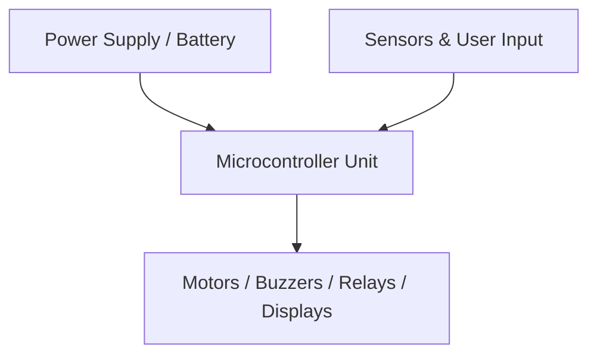

# Proteus Simulated Microcontroller Buzzer Alarm Circuit 🔊⚡ - Technical Design & Circuit Architecture

## Hardware Components (BOM)
- ATmega328P / 8051 Microcontroller
- Active & Passive Sounders
- NPN Transistor (2N2222) Driver
- Current Limiting Resistors
- Proteus VSM Simulation .pdsprj

## System Capabilities
- PWM-driven Tone & Frequency Synthesis
- Transistorized High-Decibel Buzzer Amplification
- Interactive Button Trigger Simulation
- Complete Proteus Design Suite Project
